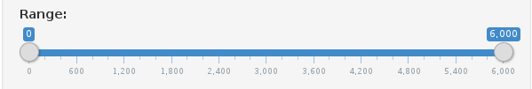
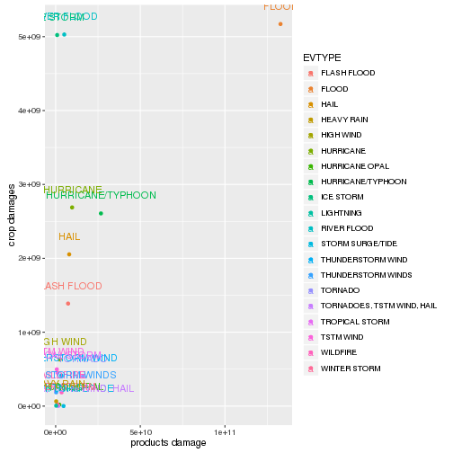
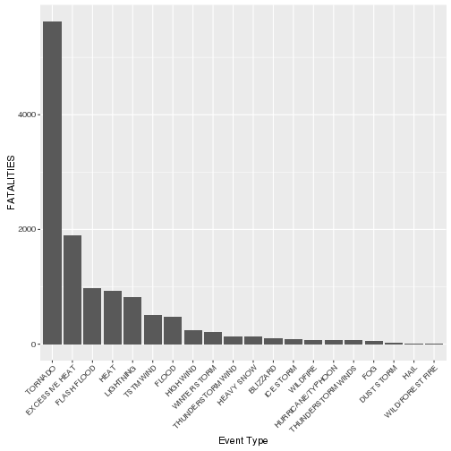

Storm Data Exploration
========================================================
author: Aya Mahfouz
date: 10 October 2016

Overview
========================================================

This application provides an overview of the catastrophies
caused by major storms and weather events. They are divided into:

1. Casualities

  1.1 Fatalities

  1.2 Injuries

2. Damages
  
    2.1 Products Damages
    
    2.2 Crops Damages

User Guide 1
========================================================
### Tabs

* There are three clickable tabs:
  * Documentation : How the application works
  * Casualities: Graphs on fatalities and injuries
  * Costs: Graphs on products and crops' damages

### Sliders

* Used to control the range of values for one variable

User Guide 2
========================================================
### Scatter Plots
* They display top events with respect to two variables

User Guide 3
========================================================
### Bar Charts
* They display top events with respect to one variable

